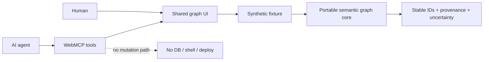

# DSH Project Atlas

**Projects made legible to people and agents.**

DSH Project Atlas is a read-only architecture workspace built for the WebMCP
Challenge. A person and an AI agent can inspect the same semantic graph, focus
the same entity, trace a source-backed path, and review uncertainty without
giving the agent database, shell, deployment, or mutation access.

The live page uses a fully synthetic project named **Orchid Commerce**. No
customer, employee, production, or private-project data is included.

The graph engine's 24-node fixture is generated and hash-verified during tests.
The eight-node capability chain shown in the interface is a separate, clearly
labelled **synthetic architectural overlay** designed to demonstrate policy,
runtime-evidence, and blind-spot states that the project-neutral analyzer does
not claim to infer.

## Why WebMCP

Without structured browser tools, an agent has to infer meaning from pixels and
DOM text. Project Atlas registers explicit tools through
`document.modelContext.registerTool()` so the agent receives stable entity IDs,
bounded schemas, and typed results while the human sees the same selection in
the interface.

| Tool | Purpose | Side effects |
| --- | --- | --- |
| `inspect_project_overview` | Summarize the pinned synthetic project and integrity state | None |
| `focus_graph_entity` | Focus one exact entity in the shared interface | UI focus only |
| `trace_architecture_path` | Return a bounded, source-backed path | UI focus only |
| `list_security_findings` | List minimized findings while preserving unknown states | Changes view only |
| `compare_architecture_layers` | Compare expected and observed layers | Changes view only |

Unknown, fuzzy, stale, or unsupported requests do not get promoted into facts.
The tools expose no network call, credential, production command, SQL, or data
mutation surface.

## Try these prompts

- “Inspect the current project overview.”
- “Focus `handler:lookup` and explain why it needs proof.”
- “Trace the path from `screen:project-search` to `store:catalog`.”
- “List high-severity architecture findings.”
- “Compare the security layers and preserve every unknown.”

The page remains a normal interactive demo in browsers that do not yet expose
WebMCP. Its status pill then reads **Browser preview**.

## Architecture



The repository contains two deliberately separate parts:

- the new Project Atlas interface and WebMCP integration created for the
  challenge;
- `packages/semantic-graph-core`, a dependency-free, project-neutral graph
  engine with deterministic IDs, conservative analyzers, provenance, querying,
  validation, and a synthetic multi-language fixture.

The portable core existed before this challenge. The shared WebMCP workspace,
five browser tools, public packaging, and challenge demo are the meaningful new
extension. This distinction is intentional and reviewable in Git history.

## Local development

Requirements: Node.js 24 or newer and npm.

```bash
npm install
npm run dev
```

Open `http://localhost:3000`.

Run the complete local verification gate:

```bash
npm run verify
```

The semantic core has no third-party runtime dependencies and can be checked on
its own:

```bash
npm --prefix packages/semantic-graph-core test
npm run check:core
```

## Public-data boundary

Only synthetic fixtures and project-neutral code are allowed in this
repository. The automated public-boundary check rejects common private path,
credential, and internal-project markers. See
[`docs/PRIVACY-BOUNDARY.md`](docs/PRIVACY-BOUNDARY.md).

The latest reproducible checks and pinned digests are recorded in
[`docs/VERIFICATION.md`](docs/VERIFICATION.md).

## License

Licensed under the [Apache License 2.0](LICENSE).
