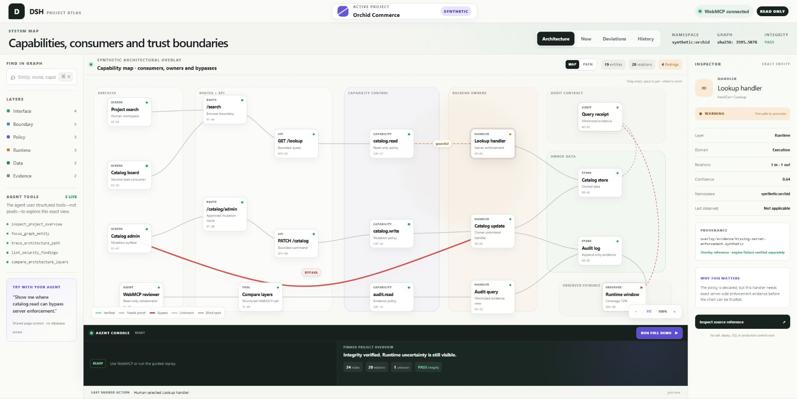
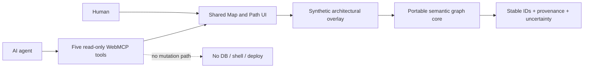

# DSH Project Atlas

**Projects made legible to people and agents.**

DSH Project Atlas is a read-only architecture workspace built for the WebMCP
Challenge. A person and an AI agent can inspect the same semantic graph, focus
the same exact entity, trace a source-backed path, and review uncertainty
without giving the agent database, shell, deployment, or mutation access.

- [Open the live demo](https://dsh-project-atlas.dr-satim.chatgpt.site)
- [View the public source repository](https://github.com/ZIVE01/dsh-project-atlas)



The demo uses a fully synthetic project named **Orchid Commerce**. No customer,
employee, production, or private-project data is included.

## What the Atlas shows

The main **Map** view is an Obsidian-like capability map with 19 visible nodes
and 20 explicit relations. It separates the project into seven domains:

- experience;
- delivery boundaries;
- capability control;
- execution;
- owned data;
- audit contracts; and
- observed evidence.

Capabilities sit between interfaces and backend owners, making it possible to
see which screens and tools consume a capability, which handler enforces it,
which data it reaches, and which evidence supports the relation. Verified,
needs-proof, unknown, blind-spot, and review states remain visually distinct.
A red **BYPASS** relation demonstrates a legacy direct UI-to-handler path that
skips the approved route, API, and capability chain.

The **Path** view reduces the map to one bounded source-backed route. It lets a
human or agent explain a specific flow without losing the complete map or
silently inventing missing links.

The project-neutral graph engine uses a separate generated, hash-verified
24-node fixture with 20 edges and one explicit unknown. The 19-node interface
map is a clearly labelled synthetic architectural overlay for demonstrating
capability ownership, enforcement, evidence, and bypass states.

## Why WebMCP

Without structured browser tools, an agent has to infer meaning from pixels and
DOM text. Project Atlas registers explicit tools through
`document.modelContext.registerTool()` so the agent receives stable entity IDs,
closed schemas, and typed results while the human sees the same focus, path,
finding, or comparison in the interface.

The application contains a literal registration boundary:

```ts
await document.modelContext.registerTool({
  name: 'focus_graph_entity',
  description: 'Focus one exact graph entity in the shared UI.',
  inputSchema: {
    type: 'object',
    properties: {
      entityId: { type: 'string', enum: exactNodeIds },
    },
    required: ['entityId'],
    additionalProperties: false,
  },
  execute: ({ entityId }) => focusExactEntity(entityId),
});
```

The production source registers the complete tool array with the same literal
`document.modelContext.registerTool` boundary in `app/page.tsx`.

| Tool | Purpose | Side effects |
| --- | --- | --- |
| `inspect_project_overview` | Summarize the pinned synthetic project and integrity state | None |
| `focus_graph_entity` | Focus one exact entity in the shared interface | UI focus only |
| `trace_architecture_path` | Return a bounded, source-backed path | UI focus and Path view only |
| `list_security_findings` | List minimized findings while preserving unknown states | View change only |
| `compare_architecture_layers` | Compare expected and observed layers | View change only |

Unknown, fuzzy, stale, or unsupported requests do not get promoted into facts.
The tools expose no network call, credential, production command, SQL, or data
mutation surface.

## Try these prompts

- “Inspect the current project overview.”
- “Focus `capability:catalog-write` and show its consumers.”
- “Focus `handler:lookup` and explain why it needs proof.”
- “Trace the path from `screen:project-search` to `store:catalog`.”
- “List high-severity architecture findings.”
- “Compare the security layers and preserve every unknown.”

The page remains a normal interactive demo in browsers that do not expose
WebMCP. Its status pill then reads **Browser preview**.

## Test WebMCP

### ChatGPT built-in browser

Open the [live demo](https://dsh-project-atlas.dr-satim.chatgpt.site) in the
built-in browser, confirm that the status reads **WebMCP connected**, and send
one of the prompts above in the same chat.

### Google Chrome 149+

1. Open `chrome://flags/#enable-webmcp-testing`.
2. Enable the WebMCP testing flag and restart Chrome.
3. Open the live demo and use a compatible agent surface to call the five
   declared read-only tools.

The exact available Chrome build and flag behavior may change while WebMCP is
experimental. The built-in ChatGPT browser is the primary challenge test path.

## Guided visual replay

Use **RUN FULL DEMO** in the always-visible Agent Console to replay the same
read-only operations at presentation speed. The replay moves between Map and
Path, highlights the complete bounded route, exposes the red BYPASS, preserves
uncertainty, and rejects an unknown entity without changing the current
selection. On desktop, the complete workspace fits the viewport; only internal
panels may scroll when the available space is unusually small.

## Architecture



The repository contains two deliberately separate parts:

- the Project Atlas interface and WebMCP integration created for the challenge;
- `packages/semantic-graph-core`, a dependency-free, project-neutral graph
  engine with deterministic IDs, conservative analyzers, provenance, querying,
  validation, and a synthetic multi-language fixture.

The portable core existed before this challenge. The multi-domain workspace,
five browser tools, shared human/agent state, public packaging, and challenge
demo are the meaningful new extension. This distinction is intentional and
reviewable in Git history.

## Local development

Requirements: Node.js 24 or newer and npm.

```bash
npm ci
npm run dev
```

Open `http://localhost:3000`.

Run the complete local verification gate:

```bash
npm run verify
```

The semantic core has no third-party runtime dependencies and can be checked on
its own:

```bash
npm --prefix packages/semantic-graph-core test
npm run check:core
```

## Public-data boundary

Only synthetic fixtures and project-neutral code are allowed in this
repository. The automated public-boundary check rejects common private path,
credential, and internal-project markers. See
[`docs/PRIVACY-BOUNDARY.md`](docs/PRIVACY-BOUNDARY.md).

The latest reproducible checks and pinned digests are recorded in
[`docs/VERIFICATION.md`](docs/VERIFICATION.md). Challenge submission copy and
the final external steps are in
[`docs/CHALLENGE-SUBMISSION.md`](docs/CHALLENGE-SUBMISSION.md).

## License

Licensed under the [Apache License 2.0](LICENSE).
